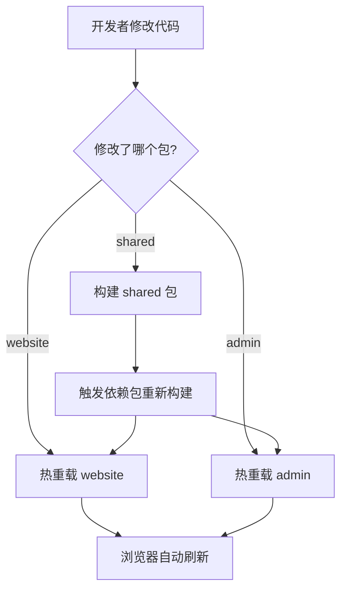
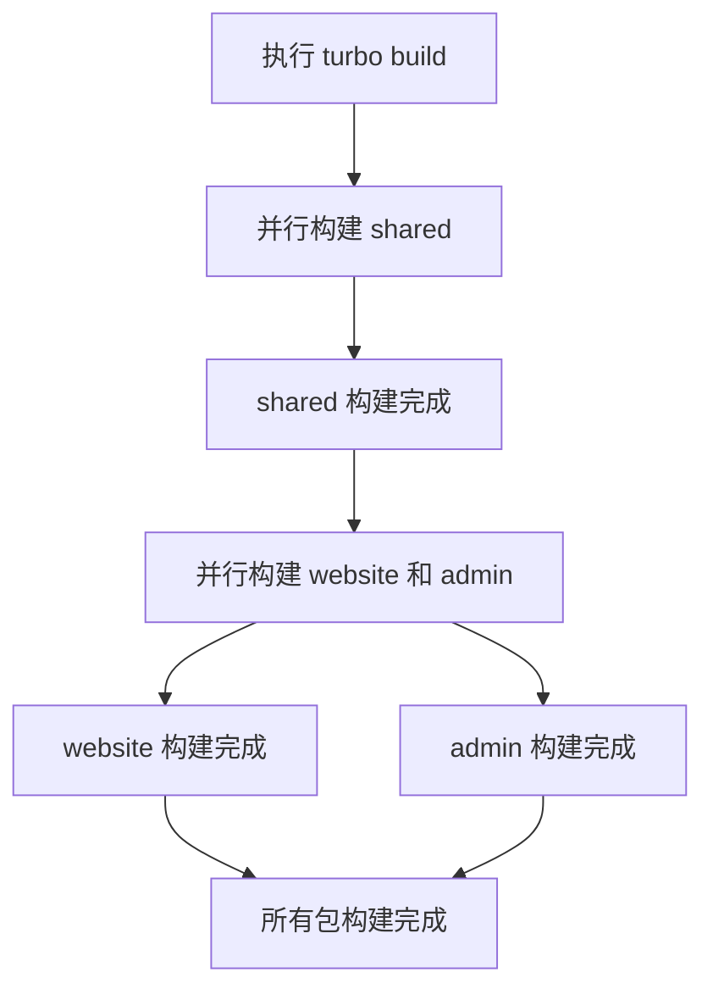
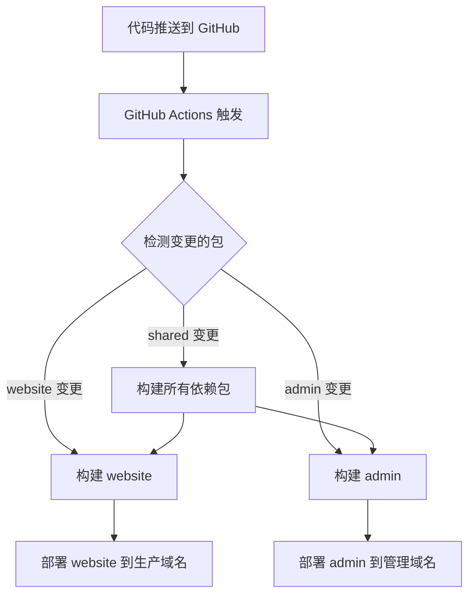

# Monorepo 架构设计文档

## 概述

本设计文档描述了将现有 Astro 导航网站重构为 Monorepo 架构的详细方案。通过 pnpm workspace 和 Turborepo 实现多包管理，将用户网站和管理后台分离为独立的子项目，同时通过共享库实现代码复用。

### 设计目标

1. **职责分离**：用户网站和管理后台完全独立
2. **代码复用**：通过共享库避免重复代码
3. **独立部署**：支持不同域名和环境的独立部署
4. **开发效率**：并行开发、构建和测试
5. **类型安全**：统一的 TypeScript 类型定义
6. **渐进迁移**：确保迁移过程中项目始终可用

## 架构

### 整体架构图

```
astro-nav-workspace/
├── packages/
│   ├── website/              # 用户导航网站
│   │   ├── src/
│   │   │   ├── pages/        # 用户页面
│   │   │   ├── components/   # 用户组件
│   │   │   └── layouts/      # 页面布局
│   │   ├── public/           # 静态资源
│   │   ├── astro.config.mjs
│   │   ├── tsconfig.json
│   │   └── package.json
│   │
│   ├── admin/                # 管理后台
│   │   ├── src/
│   │   │   ├── pages/        # 管理页面
│   │   │   ├── components/   # 管理组件
│   │   │   └── utils/        # 管理工具
│   │   ├── public/           # 静态资源
│   │   ├── astro.config.mjs
│   │   ├── tsconfig.json
│   │   └── package.json
│   │
│   └── shared/               # 共享代码库
│       ├── src/
│       │   ├── types/        # 类型定义
│       │   ├── utils/        # 工具函数
│       │   ├── constants/    # 常量定义
│       │   └── validators/   # 数据验证
│       ├── config/           # 配置文件（由 Admin 生成）
│       │   ├── config.json
│       │   ├── config-optimized.json
│       │   └── config-traditional.json
│       ├── tsconfig.json
│       └── package.json
│
├── tools/                    # 开发工具
├── docs/                     # 项目文档
├── .github/                  # CI/CD 配置
├── pnpm-workspace.yaml       # pnpm 工作区配置
├── turbo.json               # Turborepo 配置
├── package.json             # 根配置
└── tsconfig.json            # 根 TypeScript 配置
```

### 技术栈

- **包管理器**：pnpm 8.x（支持 workspace）
- **构建工具**：Turborepo 1.x（并行构建和缓存）
- **前端框架**：Astro 5.x（当前版本 5.15.1）
- **底层构建**：Vite（Astro 内置，用于开发服务器和生产构建）
- **类型系统**：TypeScript 5.x（当前版本 5.9.3）
- **代码检查**：ESLint 8.x
- **代码格式化**：Prettier 3.x
- **测试框架**：Vitest 4.x（当前版本 4.0.3）

## 组件和接口

### 1. 共享库 (@astro-nav/shared)

#### 职责
- 提供统一的类型定义
- 提供通用工具函数
- 提供数据验证逻辑
- 提供常量定义

#### 导出接口

```typescript
// types/index.ts
export interface NavConfig {
  title: string;
  description: string;
  categories: Category[];
  sites: Site[];
}

export interface Category {
  id: string;
  name: string;
  icon?: string;
  order: number;
}

export interface Site {
  id: string;
  name: string;
  url: string;
  description: string;
  categoryId: string;
  tags?: string[];
  icon?: string;
}

// utils/index.ts
export function validateConfig(config: unknown): NavConfig;
export function formatUrl(url: string): string;
export function generateId(): string;

// constants/index.ts
export const DEFAULT_CONFIG: Partial<NavConfig>;
export const ERROR_MESSAGES: Record<string, string>;
```

#### 构建配置

```json
{
  "compilerOptions": {
    "target": "ES2022",
    "module": "ES2022",
    "moduleResolution": "bundler",
    "declaration": true,
    "declarationMap": true,
    "outDir": "dist",
    "rootDir": "src"
  }
}
```

### 2. 用户网站 (@astro-nav/website)

#### 职责
- 展示导航网站
- 提供搜索功能
- 展示网站详情
- 提供网站提交表单

#### 页面结构

```
src/pages/
├── index.astro           # 首页（导航列表）
├── sites/
│   └── [id].astro       # 网站详情页
└── submit.astro         # 网站提交页
```

#### 依赖关系

```json
{
  "dependencies": {
    "@astro-nav/shared": "workspace:*",
    "astro": "^5.15.1",
    "typescript": "^5.9.3"
  }
}
```

#### Astro 配置

```javascript
// astro.config.mjs
export default defineConfig({
  site: 'https://nav.example.com',
  output: 'static',
  
  build: {
    format: 'directory',
    assets: '_astro',
    inlineStylesheets: 'auto',
    splitting: true
  },
  
  vite: {
    build: {
      minify: 'esbuild',
      cssCodeSplit: true,
      target: 'es2020'
    },
    server: {
      port: 4321,
      open: false,
      cors: true
    }
  },
  
  security: {
    checkOrigin: true
  },
  
  compressHTML: true
});
```

### 3. 管理后台 (@astro-nav/admin)

#### 职责
- 配置文件生成
- 表格数据导入
- 开发工具集合
- 数据验证和预览

#### 页面结构

```
src/pages/
├── index.astro              # 管理首页
├── config-generator.astro   # 配置生成器
├── table-import.astro       # 表格导入
└── dev-tools/
    ├── index.astro         # 工具集首页
    ├── validator.astro     # 数据验证
    └── preview.astro       # 配置预览
```

#### 依赖关系

```json
{
  "dependencies": {
    "@astro-nav/shared": "workspace:*",
    "astro": "^5.15.1",
    "papaparse": "^5.5.3",
    "jszip": "^3.10.1",
    "qrcode": "^1.5.4",
    "xlsx": "^0.18.5",
    "busboy": "^1.6.0",
    "typescript": "^5.9.3"
  }
}
```

#### Astro 配置

```javascript
// astro.config.mjs
export default defineConfig({
  site: 'https://admin.example.com',
  output: 'static',
  
  build: {
    format: 'directory',
    assets: '_astro',
    inlineStylesheets: 'auto',
    splitting: true
  },
  
  vite: {
    build: {
      minify: 'esbuild',
      cssCodeSplit: true,
      target: 'es2020',
      rollupOptions: {
        output: {
          manualChunks: {
            'vendor-utils': ['papaparse', 'qrcode'],
            'vendor-office': ['xlsx', 'jszip']
          }
        }
      }
    },
    server: {
      port: 4322,
      open: false,
      cors: true
    },
    optimizeDeps: {
      include: ['papaparse', 'qrcode']
    }
  },
  
  security: {
    checkOrigin: true
  },
  
  compressHTML: true
});
```

## 数据模型

### 配置文件管理策略

#### 设计决策：配置文件位置

在 Monorepo 架构中，配置文件的管理有以下几个方案：

**方案 A：共享配置目录（推荐）** ✅
```
packages/
├── shared/
│   └── config/
│       ├── config.json              # 主配置
│       ├── config-optimized.json    # 优化版本
│       └── config-traditional.json  # 传统版本
├── website/
│   └── static/                      # 构建时从 shared 复制
└── admin/
    └── src/utils/
        └── config-generator.ts      # 生成到 shared/config/
```

**优点：**
- 配置集中管理，单一数据源
- 版本控制友好，配置变更可追踪
- Website 和 Admin 都可以访问
- 支持配置验证和类型检查

**实现方式：**
1. Admin 生成配置到 `packages/shared/config/`
2. Website 构建脚本在构建前复制配置到 `static/`
3. 开发模式下使用符号链接或监听文件变化

**方案 B：直接写入 Website**
```
packages/
├── website/
│   └── static/
│       └── config.json              # Admin 直接写入
└── admin/
    └── src/utils/
        └── config-generator.ts      # 写入到 ../website/static/
```

**缺点：**
- 跨包写入，违反包边界
- 耦合度高，不利于独立部署
- 配置变更难以追踪

**最终选择：方案 A（共享配置目录）**

理由：
1. 符合 Monorepo 的设计原则
2. 配置作为共享资源，应该在 shared 包中
3. 支持未来扩展（如配置 API、配置版本管理）
4. 构建时复制的开销可以接受

### 配置文件结构

```typescript
// 导航配置（存储在 packages/shared/config/config.json）
interface NavConfig {
  version: string;
  metadata: {
    title: string;
    description: string;
    author?: string;
    lastUpdated: string;
  };
  categories: Category[];
  sites: Site[];
}

// 分类
interface Category {
  id: string;
  name: string;
  icon?: string;
  description?: string;
  order: number;
}

// 网站
interface Site {
  id: string;
  name: string;
  url: string;
  description: string;
  categoryId: string;
  tags?: string[];
  icon?: string;
  screenshot?: string;
  addedAt: string;
}
```

### 数据流

```
管理后台 (Admin)
    ↓
生成/导入配置
    ↓
保存到 packages/shared/config/config.json
    ↓
Website 构建脚本
    ↓
复制配置到 packages/website/static/config.json
    ↓
用户网站 (Website) 读取配置
    ↓
渲染导航页面
```

#### 配置同步机制

**开发模式：**
```javascript
// packages/website/scripts/sync-config.js
import { watch } from 'fs';
import { copyFile } from 'fs/promises';

const source = '../shared/config/config.json';
const target = './static/config.json';

// 初始复制
await copyFile(source, target);

// 监听变化
watch(source, async () => {
  await copyFile(source, target);
  console.log('配置已同步');
});
```

**构建模式：**
```json
// packages/website/package.json
{
  "scripts": {
    "prebuild": "node scripts/sync-config.js",
    "build": "astro build"
  }
}
```

## 工作流程

### 开发工作流



### 构建工作流



### 部署工作流



## 迁移策略

### 阶段 1：创建基础架构（第 1 天）

1. 创建 Monorepo 目录结构
2. 配置 pnpm workspace
3. 配置 Turborepo
4. 创建根 package.json
5. 验证：`pnpm install` 成功

### 阶段 2：创建共享库（第 1-2 天）

1. 创建 `packages/shared` 目录
2. 配置 TypeScript 和构建脚本
3. 迁移类型定义（从 `src/types/`）
4. 迁移工具函数（从 `src/utils/`）
5. 迁移常量定义
6. 验证：`pnpm --filter @astro-nav/shared build` 成功

### 阶段 3：创建用户网站（第 2-3 天）

1. 创建 `packages/website` 目录
2. 配置 Astro 和 TypeScript
3. 迁移用户页面
   - `src/pages/index.astro`
   - `src/pages/sites/[id].astro`
   - `src/pages/submit.astro`
4. 迁移用户组件
5. 迁移布局文件
6. 迁移静态资源
7. 更新导入路径（使用 `@astro-nav/shared`）
8. 验证：`pnpm --filter @astro-nav/website dev` 在 4321 端口正常运行

### 阶段 4：创建管理后台（第 3-4 天）

1. 创建 `packages/admin` 目录
2. 配置 Astro 和 TypeScript
3. 迁移管理页面
   - `src/pages/config-generator.astro`
   - `src/pages/table-import.astro`
   - `src/pages/dev-tools/`
4. 迁移管理组件
5. 迁移管理工具
6. 更新导入路径（使用 `@astro-nav/shared`）
7. 验证：`pnpm --filter @astro-nav/admin dev` 在 4322 端口正常运行

### 阶段 5：清理和验证（第 4-5 天）

1. 删除旧的 `src/` 目录结构
2. 更新根目录的配置文件
3. 验证所有功能正常工作
4. 运行测试套件
5. 验证：
   - `pnpm dev` 同时启动所有服务
   - `pnpm build` 成功构建所有包
   - 所有测试通过

### 阶段 6：更新工具链和文档（第 5 天）

1. 配置统一的 ESLint
2. 配置统一的 Prettier
3. 配置统一的测试
4. 更新 README 和文档
5. 更新 CI/CD 配置

## 错误处理

### 构建错误

```typescript
// 在 shared 包中提供错误处理工具
export class ValidationError extends Error {
  constructor(
    message: string,
    public field: string,
    public value: unknown
  ) {
    super(message);
    this.name = 'ValidationError';
  }
}

export function handleBuildError(error: Error): void {
  console.error('构建失败:', error.message);
  if (error instanceof ValidationError) {
    console.error(`字段: ${error.field}`);
    console.error(`值: ${JSON.stringify(error.value)}`);
  }
  process.exit(1);
}
```

### 运行时错误

```typescript
// 在各个包中使用统一的错误处理
try {
  const config = await loadConfig();
  validateConfig(config);
} catch (error) {
  if (error instanceof ValidationError) {
    // 显示友好的错误信息
    showErrorMessage(error.message);
  } else {
    // 记录未知错误
    console.error('未知错误:', error);
  }
}
```

### 迁移错误处理

1. **构建失败**：检查依赖关系和导入路径
2. **类型错误**：确保 shared 包已构建
3. **端口冲突**：检查端口配置
4. **路径错误**：更新所有相对路径为 workspace 引用

## 测试策略

### 单元测试

```typescript
// packages/shared/src/utils/__tests__/validate.test.ts
import { describe, it, expect } from 'vitest';
import { validateConfig } from '../validate';

describe('validateConfig', () => {
  it('should validate correct config', () => {
    const config = {
      title: 'Test',
      categories: [],
      sites: []
    };
    expect(() => validateConfig(config)).not.toThrow();
  });

  it('should throw on invalid config', () => {
    const config = { invalid: true };
    expect(() => validateConfig(config)).toThrow(ValidationError);
  });
});
```

### 集成测试

```typescript
// packages/website/src/__tests__/integration.test.ts
import { describe, it, expect } from 'vitest';

describe('Website Integration', () => {
  it('should load config and render homepage', async () => {
    // 测试配置加载和页面渲染
  });

  it('should navigate to site details', async () => {
    // 测试页面导航
  });
});
```

### E2E 测试

```typescript
// tests/e2e/user-flow.test.ts
import { test, expect } from '@playwright/test';

test('user can browse and search sites', async ({ page }) => {
  await page.goto('http://localhost:4321');
  await expect(page.locator('h1')).toContainText('导航网站');
  
  // 测试搜索功能
  await page.fill('input[type="search"]', 'test');
  await expect(page.locator('.site-card')).toHaveCount(1);
});
```

## 性能优化

### 构建性能

1. **Turborepo 缓存**：利用远程缓存加速 CI/CD
2. **并行构建**：同时构建独立的包
3. **增量构建**：只构建变更的包

### 运行时性能

1. **代码分割**：每个包独立打包
2. **按需加载**：只加载需要的功能
3. **静态生成**：Astro 静态生成页面

### 开发体验

1. **热重载**：快速的开发反馈
2. **类型提示**：完整的 TypeScript 支持
3. **并行开发**：同时运行多个服务

## 安全考虑

### 访问控制

1. **域名隔离**：用户网站和管理后台使用不同域名
2. **环境变量**：敏感配置通过环境变量管理
3. **构建隔离**：管理后台不包含在用户网站构建中

### 数据验证

```typescript
// 在 shared 包中提供统一的验证
export function validateSiteUrl(url: string): boolean {
  try {
    new URL(url);
    return true;
  } catch {
    return false;
  }
}

export function sanitizeInput(input: string): string {
  return input
    .trim()
    .replace(/[<>]/g, ''); // 防止 XSS
}
```

## 部署架构

### 生产环境

```
用户网站 (Website)
├── 域名: https://nav.example.com
├── 构建: packages/website/dist
└── 服务: Vercel / Netlify / Cloudflare Pages

管理后台 (Admin)
├── 域名: https://admin.nav.example.com
├── 构建: packages/admin/dist
└── 服务: Vercel / Netlify / Cloudflare Pages
```

### CI/CD 流程

```yaml
# .github/workflows/deploy.yml
name: Deploy

on:
  push:
    branches: [main]

jobs:
  changes:
    runs-on: ubuntu-latest
    outputs:
      website: ${{ steps.filter.outputs.website }}
      admin: ${{ steps.filter.outputs.admin }}
    steps:
      - uses: actions/checkout@v3
      - uses: dorny/paths-filter@v2
        id: filter
        with:
          filters: |
            website:
              - 'packages/website/**'
              - 'packages/shared/**'
            admin:
              - 'packages/admin/**'
              - 'packages/shared/**'

  deploy-website:
    needs: changes
    if: needs.changes.outputs.website == 'true'
    runs-on: ubuntu-latest
    steps:
      - uses: actions/checkout@v3
      - uses: pnpm/action-setup@v2
      - run: pnpm install
      - run: pnpm --filter @astro-nav/website build
      - run: pnpm --filter @astro-nav/website deploy

  deploy-admin:
    needs: changes
    if: needs.changes.outputs.admin == 'true'
    runs-on: ubuntu-latest
    steps:
      - uses: actions/checkout@v3
      - uses: pnpm/action-setup@v2
      - run: pnpm install
      - run: pnpm --filter @astro-nav/admin build
      - run: pnpm --filter @astro-nav/admin deploy
```

## 回滚策略

### Git 回滚

```bash
# 回滚到上一个稳定的提交
git revert HEAD
git push

# 或者重置到特定提交
git reset --hard <commit-hash>
git push --force
```

### 部署回滚

1. **Vercel**：在控制台选择之前的部署版本
2. **Netlify**：在控制台回滚到之前的部署
3. **Cloudflare Pages**：选择之前的部署版本

### 数据回滚

```bash
# 恢复配置文件
git checkout HEAD~1 -- packages/website/public/config.json
git commit -m "revert: 恢复配置文件"
```

## 监控和日志

### 构建监控

```json
{
  "scripts": {
    "build": "turbo run build --summarize",
    "build:trace": "turbo run build --trace"
  }
}
```

### 运行时监控

```typescript
// 在生产环境中添加错误追踪
if (import.meta.env.PROD) {
  window.addEventListener('error', (event) => {
    console.error('运行时错误:', event.error);
    // 发送到错误追踪服务
  });
}
```

## 文档更新

### 需要更新的文档

1. **README.md**：项目概述和快速开始
2. **docs/architecture.md**：架构说明
3. **docs/development.md**：开发指南
4. **docs/deployment.md**：部署指南
5. **packages/*/README.md**：各包的说明文档

### 文档内容

- Monorepo 架构说明
- 各子包的职责和用途
- 开发环境设置
- 常用命令和脚本
- 故障排查指南
- 贡献指南

## 总结

这个 Monorepo 架构设计提供了：

1. ✅ **清晰的职责分离**：用户网站和管理后台完全独立
2. ✅ **高效的代码复用**：通过共享库避免重复
3. ✅ **灵活的部署方案**：支持独立部署和域名隔离
4. ✅ **优秀的开发体验**：并行开发、快速构建、完整类型支持
5. ✅ **安全的迁移策略**：渐进式迁移，每步验证
6. ✅ **完善的测试覆盖**：单元测试、集成测试、E2E 测试
7. ✅ **可靠的错误处理**：统一的错误处理和回滚机制
